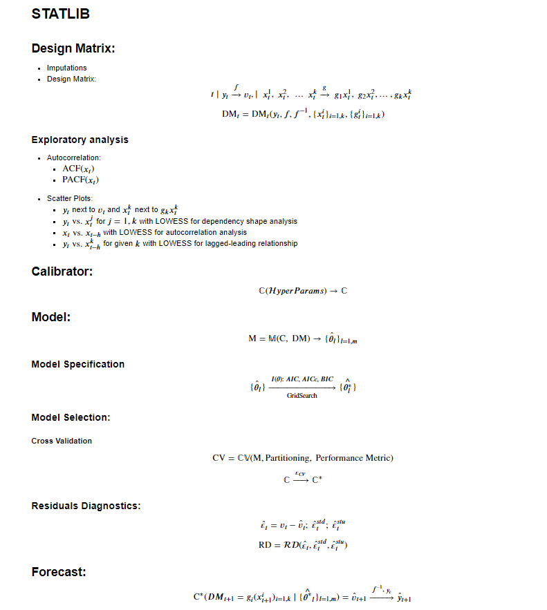

# statslib
I'm developing a lightweight Python library for rapid statistical and ML modelling, based on:
* `pandas`
* `statsmodels`
* `scikit-learn`

***
# Examples:

Please see following jupyter notebooks:
* [statslib demo](https://nbviewer.jupyter.org/github/ashubertt/statslib/blob/main/jupyter/Statslib_Demo.ipynb) for library overview
* [ts linear model](https://nbviewer.jupyter.org/github/ashubertt/statslib/blob/main/jupyter/Time%20Series%20Linear%20Model.ipynb)
* [ARIMAX](https://nbviewer.jupyter.org/github/ashubertt/statslib/blob/main/jupyter/ARIMAX.ipynb)

Please use `conda_env.yml` to create `statslib_env` conda virtual environment.

***
# Modelling Framework:

***
# Class structure:
* `DesignMatrix`
* `GeneralTransform`  
* `GeneralCalibrator`
* `GeneralModel`
* `CrossValidation`

# Functions:
* `metrics`

# Data:
* `SmartData`
***

