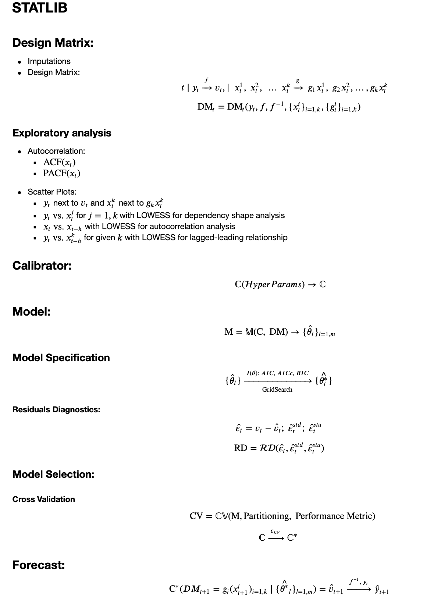

# statslib
I'm developing lightweight Python library for rapid statistical and ML modelling, based on:
* `pandas`
* `statsmodels`
* `scikit-learn`

***
# Modelling Framework:

***
# Examples:

Please see this [jupyer notebook](https://nbviewer.jupyter.org/github/ashubertt/statslib/blob/main/docs/Statslib%20Demo.ipynb) for demonstration. 

Please use `conda_env.yml` to create `statslib_env` conda virtual environment.

***
# Class structure:
* `DesignMatrix`
* `GeneralTransform`  
* `GeneralCalibrator`
* `GeneralModel`
* `CrossValidation`

# Functions:
* `metrics`

# Data:
* `SmartData`

***

