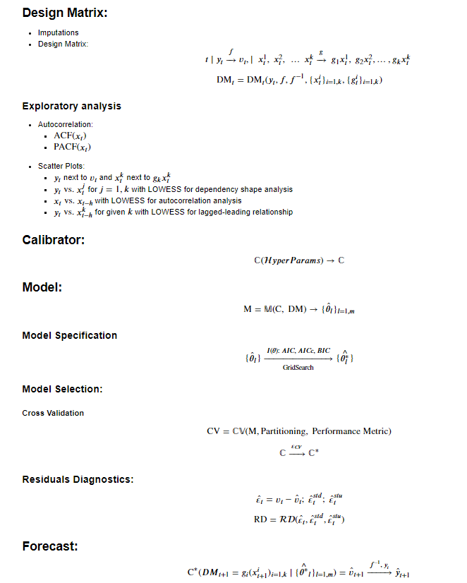

# StatsLib
I'm developing a lightweight Python library for rapid statistical and ML modelling, based on:
* `pandas`
* `statsmodels`
* `scikit-learn`
* `tensorflow`
* `keras`
* `pytorch`

***
# Examples:

Please see the following exemplar jupyter notebooks:
* StatsLib:
    * [Demo]()
    * [Framework]()
      

* Cross-Sectional:
   * [Associations]()
   * [Linear Model]()
   * [Logistic Model]()
  
    
* Time-Series:
    * [Linear Model]()
    * [SARIMAX]()
    * [Support Vector Regression (kernel)]()    
    * [Neural Network Autoregression]()
    * [Long Short-Term Memory Recurrent Neural Network]()
  
    
* Classification:
    * [Decision Tree]()
    * [Random Forest]()
      

* Clustering:
    * [K-means]()
  

* Deep Learning:
    * [Convolution Neural Network]()
    * [Transfer Learning]()
    * [VGG Visual Geometry Group Network]()
    * [Residual Networks]()
    * [Inception Networks]()
    * Generative Models:
        * [Variational Autoencoders]()
        * [Generative Adversarial Networks]()
    
    
Please see [html]() folder for HTML copies of jupyter notebooks.

***

Please use `conda_env.yml` to create `statslib_env` conda virtual environment.

***
# Modelling Framework:

***
# Class structure:
* `DesignMatrix`
* `GeneralTransform`  
* `GeneralCalibrator`
* `GeneralModel`
* `CrossValidation`

# Functions:
* `metrics`

# Data:
* `SmartData`
***

